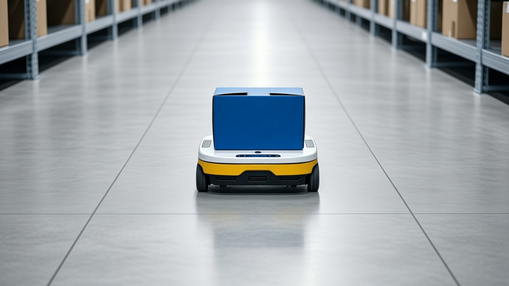
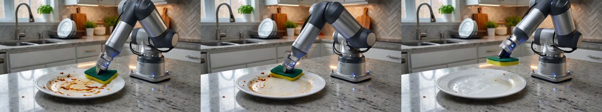
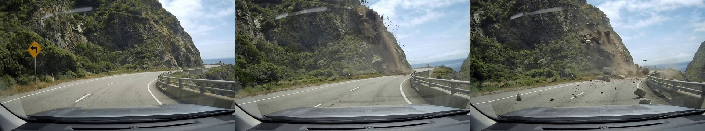
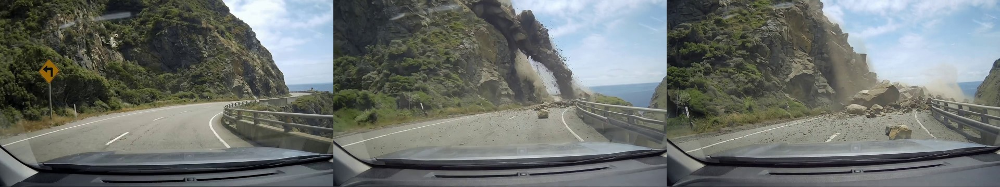
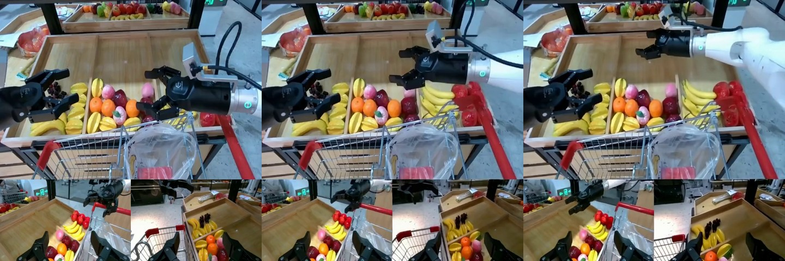

## Cosmos3-Super on 2x H100

This validates the `cosmos3/super-adapters` branch on a single node with two
NVIDIA H100 80GB HBM3 GPUs. It's the 2-GPU campaign — 4- and 8-GPU qualification
are separate follow-ups.

Checkpoint: `nvidia/Cosmos3-Super@fe77b66696d645f663b8f27e942b3b43e4629e23`
(124 GB snapshot). Both generation and the reasoner run on the same native
runtime: SGLang pinned at commit `4e9e407d3720045d59cae185c05f33649f4e544e`, with
`sglang-kernel==0.4.7` and `flashinfer-python==0.6.18`. The runtime is pinned
because the released SGLang 0.5.19 can't serve the reasoner — it doesn't register
`Cosmos3ForConditionalGeneration`.

### Generation modes

Every generation mode works. These numbers come from
`tests/test_model/test_cosmos3_super_generator_ci.py`, which runs each mode in
its own fresh server — so a case's peak memory isn't inflated by the previous
one — at TP=2 with 24 DiT layers kept resident:

| Mode | Result | Latency | Peak GPU 0 / 1 | Notes |
| --- | --- | ---: | ---: | --- |
| T2I | PASS | 129.0 s | 57.7 / 60.9 GB | single frame, structured prompt |
| T2V | PASS | 258.6 s | 65.7 / 66.7 GB | 1280x720, 121 frames |
| I2V | PASS | 263.3 s | 66.9 / 67.4 GB | image-conditioned |
| T2V + sound | PASS | 259.9 s | 66.3 / 67.2 GB | ~5.04 s AAC audio track |
| V2V continuation | PASS | 319.9 s | 66.9 / 67.8 GB | continues the bundled i2v clip |
| Forward dynamics | PASS | 558.7 s | 57.3 / 56.8 GB | 4-chunk AgiBotWorld rollout, 640x640, 29-D |
| Inverse dynamics | PASS | 192.6 s | 59.1 / 58.6 GB | AV clip -> action, shape [60, 9] |

All seven use the checkpoint's own bundled example inputs, so there's no external
data to fetch:

```bash
COSMOS3_SUPER_RUN_GPU=1 pytest tests/test_model/test_cosmos3_super_generator_ci.py -s
```

Policy (Edge-Policy-DROID) is the one mode missing from that table: the checkpoint
ships no policy example, and building the input needs an external DROID sample.
It still runs — along with the text, image, and video reasoner paths — in the
opt-in smoke suite, which also checks that every owned stage/native process tree
is gone after shutdown:

```bash
COSMOS3_SUPER_RUN_GPU=1 pytest tests/integration/cosmos3/test_super_gpu.py -s
```

### Reasoner lifecycle

A dedicated lifecycle case passed in 212.5 s. It starts the TP=2 reasoner, admits
and cancels a long request, confirms a follow-up still answers `4`, kills the
owned stage process and watches the runner raise `Dead stage process` within 30 s,
asserts the process tree is cleaned up, then starts a fresh owner and gets `4`
again. One open nit: the Python resource tracker still reports 6 leaked semaphores
and 3 shared-memory names at interpreter exit, even though no worker survives and
both GPUs return to 81,079 MiB free — worth tracking as a cleanliness follow-up.

### Fitting Super on 2x 80GB

Super's stock generation config is built for 4 GPUs (`runtime_gpu_ids: [0, 1, 2, 3]`,
`hsdp_shard_dim: 4`), and the model declares a 120 GiB threshold for keeping its
DiT resident while leaving the DiT out of the automatic layerwise-offload set. On
two idle GPUs (78.7 GiB free each) the unmodified setup keeps the full 117.85 GB
transformer resident and runs out of memory on the first T2I transition — GPU 0
had 371 MiB free and couldn't place a 500 MiB tensor. So two 80GB cards need the
DiT offloaded explicitly:

```json
{
  "generation": {
    "component_residency": {"transformer": "layerwise-offload"},
    "layerwise_resident_layers": {"transformer": 24}
  }
}
```

Keeping 24 of the 128 DiT layers resident and streaming the rest from host each
step is the 2-GPU default (FSDP shard dim 2 plus native auto-CFG parallel degree
2). It holds up on the heaviest workload — a full 189-frame 1280x720
image-to-video — at about 71 GiB/device; the CI recipe below is lighter
(121 frames), and fewer resident layers fit comfortably too. None of this says the
stock 4-GPU YAML is wrong; it just doesn't fit two cards fully resident.

### Reasoner accuracy

Omni output scored against ground truth on 50 CI samples per benchmark at TP=2,
using the shared `benchmarks/` scorer (`parse_multi_choice_response`), with no
failed requests:

| Evaluation | Sample source | Omni |
| --- | --- | ---: |
| MMMU | `mmmu-ci-50` | 30/50 (60%) |
| MMMU, strict scoring | Same 50 samples; random-fallback answers counted as incorrect | 30/50 (60%) |
| VideoMME | `videomme-ci-50` | 28/50 (56%) |

MMMU moves by a sample or two between runs — at concurrency 8, temperature 0 isn't
fully deterministic. Per-sample records and the summary are in `reasoner-accuracy/`,
and the commands are under Reproduction.

### Generation quality

The clips below are branch outputs from the checkpoint's official structured
prompts at a CI-speed recipe: 1280x720 (the largest resolution we support),
121 frames at 24 fps (~5.04 s — 121 = 4*30+1, the nearest count the temporal VAE
accepts to 120), 35 steps, CFG 6, flow shift 10, seed 17, with the 24-layer DiT
offload above. Each clip decoded to its full frame count. T2I runs the same recipe
at a single frame from a structured (Cosmos3-schema) prompt. V2V and the action
modes use the checkpoint's bundled examples; forward dynamics is the full 4-chunk
AgiBotWorld rollout, where each chunk conditions on the previous chunk's last
frame. The audiovisual clip carried a ~5.04 s AAC track with real (nonzero) energy.

<!--
GitHub upload note: drag the MP4s from generation-quality/ into the Result cells
in the PR editor and GitHub rewrites the relative links into rendered players (as
in #2107). The relative links below stay usable in the saved artifact bundle.
-->

| Task | Prompt / input | Result |
| --- | --- | --- |
| T2I | Structured Cosmos3 T2I prompt: a small warehouse robot moving a blue box across a clean floor |  |
| T2V | [NVIDIA structured prompt](https://huggingface.co/nvidia/Cosmos3-Super/blob/fe77b66696d645f663b8f27e942b3b43e4629e23/assets/example_t2v_prompt.json) | [t2v-output.mp4](generation-quality/t2v-output.mp4)<br> |
| I2V | [NVIDIA structured prompt](https://huggingface.co/nvidia/Cosmos3-Super/blob/fe77b66696d645f663b8f27e942b3b43e4629e23/assets/example_i2v_prompt.json) + [conditioning image](https://huggingface.co/nvidia/Cosmos3-Super/blob/fe77b66696d645f663b8f27e942b3b43e4629e23/assets/example_i2v_input.jpg) | [i2v-output.mp4](generation-quality/i2v-output.mp4)<br> |
| T2V + audio | [NVIDIA audiovisual structured prompt](https://huggingface.co/nvidia/Cosmos3-Super/blob/fe77b66696d645f663b8f27e942b3b43e4629e23/assets/example_t2vs_prompt.json) | [t2vs-output.mp4](generation-quality/t2vs-output.mp4)<br> |
| V2V continuation | Bundled i2v prompt, continuing the checkpoint's `example_i2v_output.mp4` | [v2v-output.mp4](generation-quality/v2v-output.mp4)<br> |
| Forward dynamics | Bundled AgiBotWorld example (`example_action_fd_agibotworld_*`), 4-chunk rollout, 29-D actions | [forward_dynamics-output.mp4](generation-quality/forward_dynamics-output.mp4) (4 chunks concatenated)<br> |
| Inverse dynamics | Bundled AV example video (`example_action_id_av_0_input.mp4`) | [inverse_dynamics-action.json](generation-quality/inverse_dynamics-action.json) — predicted action, shape `[60, 9]` |

### Reproduction

The checkpoint is gated and the serving path pulls the pinned revision on first
launch (`resolve_checkpoint` -> `snapshot_download`), so there's no separate
download step — just have `HF_TOKEN` in the environment. The pinned native runtime
is the one listed at the top.

Smoke + lifecycle across every mode (generation, reasoner, and policy):

```bash
COSMOS3_SUPER_RUN_GPU=1 pytest tests/integration/cosmos3/test_super_gpu.py -s
```

Full-resolution generation for all seven recorded modes (inputs are bundled in the
checkpoint):

```bash
COSMOS3_SUPER_RUN_GPU=1 pytest tests/test_model/test_cosmos3_super_generator_ci.py -s
```

Reasoner accuracy — prefetch the CI eval subsets (public datasets, no token), then
serve the TP=2 reasoner and score MMMU and VideoMME in one run:

```bash
python -m benchmarks.dataset.prepare --dataset mmmu-ci-50
python -m benchmarks.dataset.prepare --dataset videomme-ci-50

COSMOS3_SUPER_RUN_GPU=1 pytest tests/test_model/test_cosmos3_super_reasoner_ci.py -s -x
```

### Saved evidence

- `generation-quality/`: recorded outputs for all seven generation modes —
  `t2i-output.png`, the `{t2v,i2v,t2vs,v2v}-output.mp4` and
  `forward_dynamics-output.mp4` clips, `inverse_dynamics-action.json`, and the
  contact sheets under `previews/`.
- `reasoner-accuracy/`: the MMMU/VideoMME run — `summary.json` plus the raw
  per-sample `{mmmu,videomme}_results.json` (50 samples each, 0 failed).
- `lifecycle-reasoner.{log,xml}`: the cancellation/failure/cleanup/restart case.
- `expected-failure-stock-2gpu-fsdp-oom.{log,xml}`: the stock 2-GPU OOM described
  above, kept as evidence (not a current regression).
- `expected-failure-sglang-0.5.19-reasoner-registration.{log,xml}`: the released
  runtime rejecting the reasoner, which is why the native revision is pinned.
- `SHA256SUMS`: integrity manifest for the bundle.

Functional smoke and lifecycle aren't kept as static artifacts — they reproduce
from the committed `tests/integration/cosmos3/test_super_gpu.py`.
